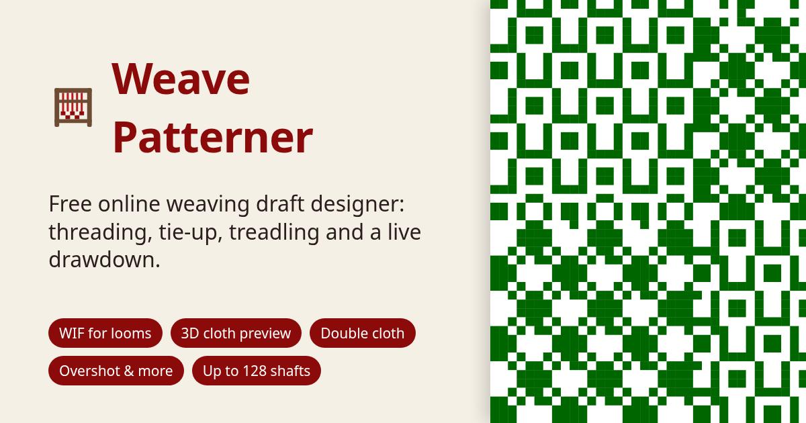

# Weave Patterner – free online weaving draft designer

**[Open Weave Patterner](https://steves165.github.io/weave-patterner/)**: it runs in your browser, free, with no account or download.



A weaving draft editor for handweavers: set the threading, tie-up and treadling, pick warp and weft colours, and see the drawdown update live. Patterns can be saved in the browser (up to 200) or exported and imported as `.weave.json` files. An example is in `samples/`.

For looms and other weaving software, Export also writes [WIF](https://www.mhsoft.com/wif/wif.html) 1.1 files, either with tie-up and treadling or as a lift plan for computer-dobby looms. Import reads WIF files too.

```sh
npm install
npm run dev     # local dev server
npm run build   # production build in dist/
npm test          # unit tests (Vitest)
npm run test:e2e  # browser tests (Playwright; desktop, phone and tablet)
npm run lint      # Biome lint + format check (npm run format to fix)
```

## Features

- Up to 128 shafts and 128 treadles (as in WeavePoint), and up to 400 ends and picks
- **No tie-up** mode for table, dobby and computer looms: the draft stays a lift plan and the tie-up is hidden
- Double cloth: separate layers, tubes, double width and block double cloth, with face and back views that allow for layers
- 3D preview (WebGL): turn, zoom and flip the cloth to see how the threads go over and under, including both layers of double cloth, with thread sizes and textures (smooth, wool, silk, slub, bouclé) from the yarn library and spacing from the sett; shown flat, draped, as a cushion or rolled, with a weaving animation; soft shadows, room lighting and flattened, fibrous yarns; or made up on a sofa, as a rug or as a tapestry at real (or enlarged) scale
- Click a drawdown square to outline the threading, tie-up, treadling and colours that decide it, with an explanation
- Remembers your settings and the pattern you were working on (saved or not) on this device
- **Straight and point draw**: drag along the threading or treadling to draw 1 2 3 4 … or 1 2 3 4 3 2 …
- Edit threading, tie-up and treadling by click, drag, keyboard or touch, with undo/redo (Ctrl+Z, Ctrl+Shift+Z)
- Per-thread warp and weft colours
- **Weaving mode**: a full-screen, pick-by-pick guide for the loom (treadles or shafts), keyboard and page-turner
  pedal friendly, remembering where you stopped, with a chime when the weft colour changes; and an end-by-end
  threading guide (shaft and heddle for each end, from either side)
- **Variations** and **colourways**: galleries of the same threading with other tie-ups and treadlings, and the same
  cloth in other colours (including colours taken from a photo)
- **Warp winding plan**: colour runs for the warping board, in bouts, with tick boxes and totals
- **Checks**: long floats, threads that never interlace, and edges the weft won't catch (floating selvedge needed)
- **Transform draft**: turn 90° (swap warp and weft), swap face and back, flip, move the repeat, and insert or
  remove tabby
- **Sequence tools**: fill ranges with straight, point, advancing-twill or custom draws; repeat, mirror, reverse,
  insert, delete, **copy and paste** ends and picks (including threading into treadling); **tromp as writ**
- **Lift plans**: convert to a lift plan for dobby looms and back to a tie-up and treadling
- **Colours**: stripe sequences for warp and weft; colour-and-weave presets (houndstooth, log cabin, gingham,
  broken-twill check)
- **Display options**: end 1 on the right, numbers in boxes, rulers every N threads, hover crosshair, fabric
  (thread) view, sinking-shed tie-up, threading below the drawdown
- **Network and parallel threadings** from a pattern line or base sequence
- **Design by drawing the cloth**: works out the smallest threading, tie-up and treadling for a drawn cloth
- **Block profiles**: design in blocks and substitute turned twill, overshot, crackle, summer and winter, Bronson
  lace, M's and O's, damask (turned 5-end satin), shadow weave, taqueté or rep weave
- **Picture to draft**: turn a picture into blocks for summer and winter, taqueté, rep, turned twill, double cloth
  or damask
- **Echo weave**: a design line threaded with its echo in two colours
- **Smallest repeat**: found automatically, with a button to trim the draft to it
- **Cloth report**: warp and weft faces, how much the threads interlace, float lengths and firmness
- **Save treadles**: a skeleton tie-up that presses two treadles at once to use fewer
- **Rigid heddle**: instructions for weaving a draft with a rigid heddle and pick-up stick, or why it can't be
- **Tablet weaving**: a card-weaving designer with hole colours, S/Z threading, turning and a band preview
- **Yarn library**: named yarns matched by colour, used by the warp calculator for weight and cost
- **Long-float highlighting** and float statistics
- **Warp calculator**: width in reed, warp length and yarn per colour, with optional weight and cost
- Save up to 200 patterns in the browser; export/import `.weave.json` and WIF (including lift plans for dobby looms);
  export PNG and SVG images
- Print the draft in the classic layout, optionally with written threading/treadling instructions; light and dark
  themes; phone and tablet friendly

## Code layout

| Path | What's there |
|---|---|
| `src/*.ts` | Pure logic with unit tests: drafts (`weave`), WIF, floats, sequence tools, calculator, weaving, history |
| `src/components/` | UI pieces: toolbar, settings panel, draft view, grids, print sheet |
| `src/dialogs/` | Save, load, import, sequence tools, warp calculator, weaving mode |
| `src/hooks/` | Undo history and share-link loading |
| `e2e/` | Playwright tests |
| `mcp/` | MCP server for AI assistants |

## MCP server: let AIs design patterns

`mcp/` is a [Model Context Protocol](https://modelcontextprotocol.io) server that lets AI assistants create weaving
drafts, see a preview, and export them for looms. Every result includes a link that opens the pattern in the web app.

| Tool | What it does |
|---|---|
| `create_weave_pattern` | Build a draft from threading, tie-up and treadling (or a lift plan); returns a PNG preview, float lengths and an app link |
| `export_weave_pattern` | Write or return a `.wif`, lift-plan `.wif` or `.weave.json` |
| `read_weave_file` | Read a `.wif`/`.weave.json` into editable pattern fields |

After `npm install`, add it to an MCP client. Claude Code:

```sh
claude mcp add weave-patterner -- /path/to/weave-patterner/node_modules/.bin/tsx /path/to/weave-patterner/mcp/index.ts
```

Claude Desktop, Cursor and others (`mcpServers` in their config file):

```json
{
  "mcpServers": {
    "weave-patterner": {
      "command": "/path/to/weave-patterner/node_modules/.bin/tsx",
      "args": ["/path/to/weave-patterner/mcp/index.ts"]
    }
  }
}
```

Files are read and written relative to the client's working directory. Set `WEAVE_APP_URL` to point links at another
copy of the app.

## Licence

[MIT](LICENSE) © Stephen Skidmore

Pushing to `main` deploys to GitHub Pages via `.github/workflows/deploy.yml`.
